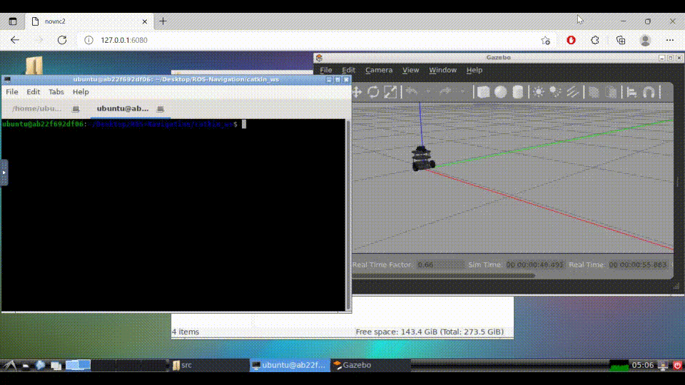

# ROS-TurtleBot-Tutorial
This is a tutorial to run TurtleBot examples on ROS1 and ROS2 using a self-contained Docker environment provided via this repository. We explain two modes of navigation: teleopreation using the keyboard and setting a goal via the RViz UI. These tutorials can easily be extended for autonomous navigation too but for the scope of this tutorial, we will only discuss the above mentioned modes of navigation.

## Prerequisites

### Docker
The Docker platform is used to install and run the container containing all the necessary simulation and the code files. Different OS platforms have different installation instructions. Checkout the getting started [guide](https://docs.docker.com/get-started/) to install and run your first Docker container relevant to your OS.

# ROS1 Noetic

## Installation
The Docker Image can be installed in either of the two ways:

- Pull the image (Beginners)
    ```bash
    docker pull sakshaymahna/ros-turtlebot-tutorial:noetic
    ```

- Build the image (Intermediate)
    ```bash
    docker build -t ros-turtlebot-tutorial -f ros1.Dockerfile .
    ```

## Start the container
1. Start the Docker Engine on your respective OS
2. Start the Docker Container (One time step only, from next time onwards use step 5)
    ```bash
    docker run --name tutorial -p 6080:80 --shm-size=512m sakshaymahna/ros-turtlebot-tutorial:noetic
    ```
3. Go to the URL on your browser `127.0.0.1:6080`. 
4. Stopping the container after completing the work
    ```bash
    docker stop turtlebot-tutorial
    ```
5. To restart the container (Only after step 2 has been done in the past)
    ```bash
    docker start turtlebot-tutorial
    ```

## Part 1 - Setup and Keyboard Control
1. Start the Docker Container as given in the above instructions, and open the browser at the given link `127.0.0.1:6080`. An Ubuntu Environment can be seen having the folder `catkin_ws` on the Desktop.

2. Open a terminal, by click the button on lower left side > System Tools > LXTerminal.

3. Through the terminal select the TurtleBot robot model.
    ```bash
    # Either one of the below command would work
    export TURTLEBOT3_MODEL=burger
    export TURTLEBOT3_MODEL=waffle
    export TURTLEBOT3_MODEL=waffle_pi
    ```
4. Launch the simulation through the following command. After running this command, a new Gazebo window would open with the Turtlebot robot in an empty space.
    ```bash
    roslaunch turtlebot3_gazebo turtlebot3_empty_world.launch
    ```
5. Keep the terminal window running as such, and open a new tab on the terminal through `File -> New Tab`.
6. On the new tab, first set the robot model (same as the one set in step 3) and then run the teleoperation node.
    ```bash
    # If the model selected was burger
    export TURTLEBOT3_MODEL=burger
    roslaunch turtlebot3_teleop turtlebot3_teleop_key.launch
    ```
7. Keeping this terminal tab as the active window, use the `W`, `A`, `D`, `X` and `S` keys to teleoperate the robot running in the simulation.

**Note**: Practice running the robot using these commands, as it would be important for the next part of the tutorial.

### Demo



## Part 2 - Building Map using SLAM
1. Start the Docker Container as given in the above instructions, and open the browser at the given link `127.0.0.1:6080`. An Ubuntu Environment can be seen having the folder `catkin_ws` on the Desktop.

2. Open a terminal, by click the button on lower left side > System Tools > LXTerminal.

3. Through the terminal select the TurtleBot robot model.
    ```bash
    # Either one of the below command would work
    export TURTLEBOT3_MODEL=burger
    export TURTLEBOT3_MODEL=waffle
    export TURTLEBOT3_MODEL=waffle_pi
    ```
4. Launch the simulation through the following command. After running this command, a new Gazebo window would open with the Turtlebot robot in a hexagonal arena containing 9 cylinders.
    ```bash
    roslaunch turtlebot3_gazebo turtlebot3_world.launch
    ```
5. Keep the terminal window running as such, and open a new tab on the terminal through `File -> New Terminal Tab`.
6. Launch the SLAM node in the new terminal tab, by first setting the same robot model and then launching the SLAM node. On running this command, an RViz window would open showing the sensor readings of the robot and a partial map of the environment based on those readings.
    ```bash
    # If the model selected was burger
    export TURTLEBOT3_MODEL=burger
    roslaunch turtlebot3_slam turtlebot3_slam.launch slam_methods:=gmapping
    ```
7. Keep the above terminal running as it is, and again open a new tab on the terminal as given in Step 5.
8. On the new terminal tab, start the teleoperation node.
    ```bash
    # If the model selected was burger
    export TURTLEBOT3_MODEL=burger
    roslaunch turtlebot3_teleop turtlebot3_teleop_key.launch
    ```
9. Keeping this terminal tab as the active window, use the `W`, `A`, `D`, `X` and `S` keys to teleoperate the robot running in the simulation. As the robot moves in the environment, the map in the RViz window would start building itself.
10. Move the robot around the environment, so that the complete map of the environment is built in the RViz window. After the complete map has been built, open a new terminal tab as given in Step 5 and save the map using the following command:
    ```bash
    rosrun map_server map_saver -f ~/map
    ```
11. The map would be saved as two files in the HOME (`~/`) directory named as `map.pgm` and `map.yaml`. The `pgm` file can be viewed as an image.

**Note**: Building the map in this step is important, as the map would be used in the next step of the tutorial for Localization and Navigation.

### Demo


## Part 3 - Localization and Navigation
1. Start the Docker Container as given in the above instructions, and open the browser at the given link `127.0.0.1:6080`. An Ubuntu Environment can be seen having the folder `catkin_ws` on the Desktop.

2. Open a terminal, by click the button on lower left side > System Tools > LXTerminal.

3. Through the terminal select the TurtleBot robot model.
    ```bash
    # Either one of the below command would work
    export TURTLEBOT3_MODEL=burger
    export TURTLEBOT3_MODEL=waffle
    export TURTLEBOT3_MODEL=waffle_pi
    ```
4. Launch the simulation through the following command. After running this command, a new Gazebo window would open with the Turtlebot robot in a hexagonal arena containing 9 cylinders.
    ```bash
    roslaunch turtlebot3_gazebo turtlebot3_world.launch
    ```
5. Keep the terminal window running as such, and open a new tab on the terminal through `File -> New Terminal Tab`.
6. Launch the Navigation node in the new terminal tab, by first setting the same robot model and then launching the Navigation node. On running this command, an RViz window would open showing the robot in the map that was built in the previous part. It is okay if the robot is not correctly localized on the map.
    ```bash
    # If the model selected was burger
    export TURTLEBOT3_MODEL=burger
    roslaunch turtlebot3_navigation turtlebot3_navigation.launch map_file:=$HOME/map.yaml
    ```
7. The first step is Localization. For Localization, we first set an initial pose estimate. For this, in the RViz window select the button on top that says `2D Pose Estimate`. Click on the map where the actual robot is located and drag the large green arrow toward the direction where the robot is facing. It is okay to be slightly incorrect while doing so.
8. Keep the above terminal running as it is, and open a new tab on the terminal as given in Step 5. In the new terminal tab, set the robot model and run the teleoperation node.
    ```bash
    # If the model selected was burger
    export TURTLEBOT3_MODEL=burger
    roslaunch turtlebot3_teleop turtlebot3_teleop_key.launch
    ```
9. Move the robot forward and backward until the localization corrects itself in the RViz visualization. After doing so, the robot model and it's sensor readings would be correctly overlayed on the given map.
10. The next step is Navigation. In the RViz window select the button on top that says `2D Nav Goal`. Click on the map to set the destination of the robot and drag the green arrow toward the direction where the robot will be facing. Once the arrow is set, the robot would start navigating to the goal.

### Demo


# ROS2 Dashing

## Installation
The Docker Image can be installed in either of the two ways:

- Pull the image (Beginners)
    ```bash
    docker pull sakshaymahna/ros-turtlebot-tutorial:dashing
    ```

- Build the image (Intermediate)
    ```bash
    docker build -t ros-turtlebot-tutorial -f ros2.Dockerfile .
    ```

## Start the container
1. Start the Docker Engine on your respective OS
2. Start the Docker Container (One time step only, from next time onwards use step 5)
    ```bash
    docker run --name tutorial -p 6080:80 --shm-size=512m sakshaymahna/ros-turtlebot-tutorial:dashing
    ```
3. Go to the URL on your browser `127.0.0.1:6080`. 
4. Stopping the container after completing the work
    ```bash
    docker stop turtlebot-tutorial
    ```
5. To restart the container (Only after step 2 has been done in the past)
    ```bash
    docker start turtlebot-tutorial
    ```

## Part 1 - Setup and Keyboard Control
1. Start the Docker Container as given in the above instructions, and open the browser at the given link `127.0.0.1:6080`. An Ubuntu Environment can be seen having the folder `turtlebot3_ws` on the Desktop.

2. Open a terminal, by click the button on lower left side > System Tools > LXTerminal.

3. Through the terminal select the TurtleBot robot model. **Note**: For the ROS2 image it has been observed that the `burger` model of Turtlebot3 doesn't work. So please, avoid using it.
    ```bash
    # Either one of the below command would work
    export TURTLEBOT3_MODEL=waffle
    export TURTLEBOT3_MODEL=waffle_pi
    ```
4. Launch the simulation through the following command. After running this command, a new Gazebo window would open with the Turtlebot robot in an empty space.
    ```bash
    ros2 launch turtlebot3_gazebo turtlebot3_empty_world.launch.py
    ```
5. Keep the terminal window running as such, and open a new tab on the terminal through `File -> New Tab`.
6. On the new tab, first set the robot model (same as the one set in step 3) and then run the teleoperation node.
    ```bash
    # If the model selected was waffle
    export TURTLEBOT3_MODEL=waffle
    ros2 run turtlebot3_teleop teleop_keyboard
    ```
7. Keeping this terminal tab as the active window, use the `W`, `A`, `D`, `X` and `S` keys to teleoperate the robot running in the simulation.

**Note**: Practice running the robot using these commands, as it would be important for the next part of the tutorial.

### Demo


## Part 2 - Building Map using SLAM
1. Start the Docker Container as given in the above instructions, and open the browser at the given link `127.0.0.1:6080`. An Ubuntu Environment can be seen having the folder `turtlebot3_ws` on the Desktop.

2. Open a terminal, by click the button on lower left side > System Tools > LXTerminal.

3. Through the terminal select the TurtleBot robot model. **Note**: For the ROS2 image it has been observed that the `burger` model of Turtlebot3 doesn't work. So please, avoid using it.
    ```bash
    # Either one of the below command would work
    export TURTLEBOT3_MODEL=waffle
    export TURTLEBOT3_MODEL=waffle_pi
    ```
4. Launch the simulation through the following command. After running this command, a new Gazebo window would open with the Turtlebot robot in a hexagonal arena containing 9 cylinders.
    ```bash
    ros2 launch turtlebot3_gazebo turtlebot3_world.launch.py
    ```
5. Keep the terminal window running as such, and open a new tab on the terminal through `File -> New Terminal Tab`.
6. Launch the SLAM node in the new terminal tab, by first setting the same robot model and then launching the SLAM node. On running this command, an RViz window would open showing the sensor readings of the robot and a partial map of the environment based on those readings.
    ```bash
    # If the model selected was waffle
    export TURTLEBOT3_MODEL=waffle
    ros2 launch turtlebot3_cartographer cartographer.launch.py use_sim_time:=true
    ```
7. Keep the above terminal running as it is, and again open a new tab on the terminal as given in Step 5.
8. On the new terminal tab, start the teleoperation node.
    ```bash
    # If the model selected was waffle
    export TURTLEBOT3_MODEL=waffle
    ros2 run turtlebot3_teleop teleop_keyboard
    ```
9. Keeping this terminal tab as the active window, use the `W`, `A`, `D`, `X` and `S` keys to teleoperate the robot running in the simulation. As the robot moves in the environment, the map in the RViz window would start building itself.
10. Move the robot around the environment, so that the complete map of the environment is built in the RViz window. After the complete map has been built, open a new terminal tab as given in Step 5 and save the map using the following command:
    ```bash
    ros2 run nav2_map_server map_saver -f ~/map
    ```
11. The map would be saved as two files in the HOME (`~/`) directory named as `map.pgm` and `map.yaml`. The `pgm` file can be viewed as an image.

**Note**: Building the map in this step is important, as the map would be used in the next step of the tutorial for Localization and Navigation.

### Demo


## Part 3 - Localization and Navigation
1. Start the Docker Container as given in the above instructions, and open the browser at the given link `127.0.0.1:6080`. An Ubuntu Environment can be seen having the folder `turtlebot3_ws` on the Desktop.

2. Open a terminal, by click the button on lower left side > System Tools > LXTerminal.

3. Through the terminal select the TurtleBot robot model. **Note**: For the ROS2 image it has been observed that the `burger` model of Turtlebot3 doesn't work. So please, avoid using it.
    ```bash
    # Either one of the below command would work
    export TURTLEBOT3_MODEL=waffle
    export TURTLEBOT3_MODEL=waffle_pi
    ```
4. Launch the simulation through the following command. After running this command, a new Gazebo window would open with the Turtlebot robot in a hexagonal arena containing 9 cylinders.
    ```bash
    ros2 launch turtlebot3_gazebo turtlebot3_world.launch.py
    ```
5. Keep the terminal window running as such, and open a new tab on the terminal through `File -> New Terminal Tab`.
6. Launch the Navigation node in the new terminal tab, by first setting the same robot model and then launching the Navigation node. On running this command, an RViz window would open showing the robot in the map that was built in the previous part. It is okay if the robot is not correctly localized on the map.
    ```bash
    # If the model selected was waffle
    export TURTLEBOT3_MODEL=waffle
    ros2 launch turtlebot3_navigation2 navigation2.launch.py use_sim_time:=True map:=$HOME/map.yaml
    ```
7. The first step is Localization. For Localization, we first set an initial pose estimate. For this, in the RViz window select the button on top that says `2D Pose Estimate`. Click on the map where the actual robot is located and drag the large green arrow toward the direction where the robot is facing. It is okay to be slightly incorrect while doing so.
8. Keep the above terminal running as it is, and open a new tab on the terminal as given in Step 5. In the new terminal tab, set the robot model and run the teleoperation node.
    ```bash
    # If the model selected was waffle
    export TURTLEBOT3_MODEL=waffle
    ros2 run turtlebot3_teleop teleop_keyboard
    ```
9. Move the robot forward and backward until the localization corrects itself in the RViz visualization. After doing so, the robot model and it's sensor readings would be correctly overlayed on the given map.
10. The next step is Navigation. In the RViz window select the button on top that says `2D Nav Goal`. Click on the map to set the destination of the robot and drag the green arrow toward the direction where the robot will be facing. Once the arrow is set, the robot would start navigating to the goal.

### Demo

